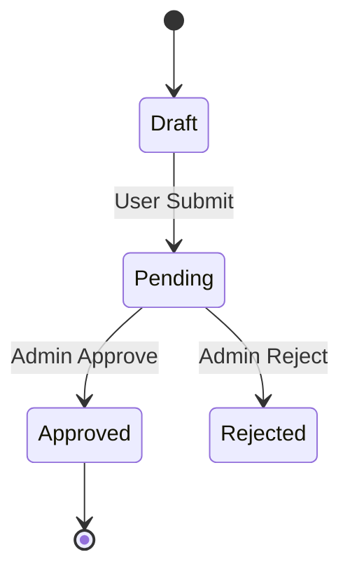

# 📐 System & Feature Spec: {{title}}

> **Project:** [[Projects/{{project}}]]  
> **Status:** Draft / Approved  
> **Primary Stack:** Nuxt 4 / React / Prisma

---

## 🎯 1. Problem Statement & User Value (ทำไมต้องทำ)
- **ปัญหาที่พบ:** ...
- **ผลลัพธ์ที่คาดหวัง:** ...
- **Non-Goals (สิ่งที่ไม่ทำในสเปกนี้):**
  - ...

---

## 👤 2. Actors & RBAC Matrix (ใครมีสิทธิ์ทำอะไร)

| Role | สิทธิ์การเข้าถึง | การกระทำที่ทำได้ (Permissions) |
|---|---|---|
| **Admin** | Full Access | สร้าง, แก้ไข, อนุมัติ, ลบ |
| **Member / User** | Scoped Access | สร้างคำขอ, ดูเฉพาะข้อมูลของตนเอง |
| **Guest / Public** | Read Only | ดูข้อมูลสาธารณะ |

---

## 🔄 3. State Lifecycle & Flow (สถานะและการเปลี่ยนแปลง)

### Happy & Unhappy Path
* **Happy Path:** ...
* **Unhappy Path:** เมื่อเกิด Reject หรือ Cancel $\rightarrow$ ...

---

## 📋 4. Functional Logic Matrix (ความต้องการรายฟังก์ชัน)

| User Action / Trigger | Validation Rules | DB / State Change | Side Effects | Expected UI Result |
|---|---|---|---|---|
| กด Submit Form | ตรวจ Zod Schema | สร้าง Entity ใหม่ | ส่ง Notification | ปิด Modal + Toast สำเร็จ |

---

## 🛡️ 5. Table-Stakes Baseline Checklist

- [ ] **UI States:** มีครบ 4 สถานะ (`Loading Skeleton`, `Empty State`, `Error + Retry`, `Success`)
- [ ] **Data Operations:** มี `Pagination / Infinite Scroll`, `Debounced Search`, `Filter`
- [ ] **Safety:** มี `Confirmation Dialog` ก่อนลบ และใช้ `Soft Delete`
- [ ] **Security:** เช็ก RBAC + Tenant Isolation ที่ Backend ซ้ำ
- [ ] **Concurrency:** มี Transaction Lock (`$transaction`) ป้องกัน Race Condition
- [ ] **Audit:** มีฟิลด์ `created_by`, `updated_at`

---

## 🧪 6. Acceptance Criteria (DoD)
1. `GIVEN` ... `WHEN` ... `THEN` ...
2. `GIVEN` ... `WHEN` ... `THEN` ...
